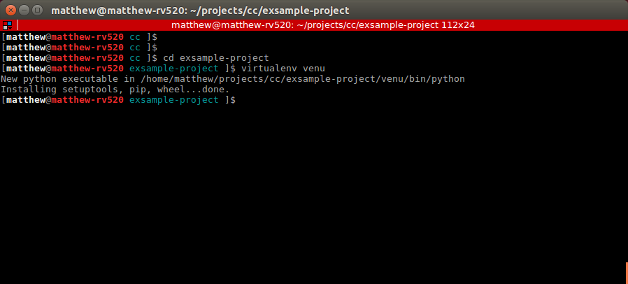
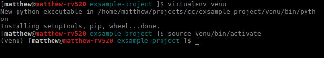

---
title: dependency-delight
level: Python3
language: en-GB
stylesheet: scratch
embeds: "*.png"
materials: ["Club Leader Resources/*","Project Resources/*"]
...

# Introduction:  { .intro}
In this project we will look at very the delightful would of dependencies, The world is full of people who code in Python. Individuals who code for fun and people who code for a job, very often people like to working in teams, and it is important when working in a team to make sure that everybody is using the same tools.

**This progect requires the users of an installed intepter on the readers computer this requires the abilty to; on windows to open the command promt(CMD) also to read, write and create files. on linux-based (raspberry-pi) computers a normal user is fine pleses refer to the volunteer notes**

## The Finished Project { .challenge }
We are going to have a project that you can share useing freands and other people Created by Matthew Proudman. the exsample.

## prerequisites
1. make sure that virtualenv is installed, `virtualenv --version` virtualenv is a tool used to create and mange virtual envioments.

2. make sure that pip is installed `pip -V`, pip is used to handle the installing and mangeing packages and projects witen by other people.

## new concepts
### Dependencice
A Dependencice is a project that someone else has writen for you to use, it is important to remember, that you can also many versions.

### virtual envoiment
A virtual envoiment is esentalay a box where you project can you install and run your code this also means that when you share code you also a clear list of the tools you have used. in python and python3 is 'virtualenv'. in javaScript you can 'npm'

### pip
pip is a tool that is useded to install the tools or 'packages', once you have created a virtual envoiment you will be alble to install packages. in this project we will be using the following commands, `pip install [packages name]`, `pip uninstall [package name]` and `pip freeze > [filename]`.

### python Standard Libary.
the python standard Libary is a Group of tools, frameworks and tools, that are considered to be usfule to most devopment there are many frameworks have diffrent uses and expericed python devopers will look python standard Libary before installing a dependency.

## Step 1: setting up our working directory { .activity}
the first thing that needs to be done is to create a space where we can start to work on our project. the first thing wee need to do is to create a new directory, to store our porjects in to create a directory use the command `mkdir [directory name]`. and then go into the directory (by useing `cd [directory name]`).

## Step 2: createing a virtualenv { .activity}
the next step is to set up the virtual envioment, you can do this by simply by ruuning the `virtualenv [envoiment name]` an exsample is shown here.

#### techical information.
what has happend when you created, your virtual envoiment all the files and directorys, that required to create the virtual envoiment, it is important remember that envoiment will be linked to the structure of you operation system and will not work on anyone else computer.

if you need to use a sing version of python you can then use the `-p` argument. as an exsample of this would be if you wanted to make sure that your project used python3 `virtualenv -p /usr/bin/python3 venu`, this mite be a little diffrent, if you are useing windows.

## Step 3: activateing your envioment
the next step is to activate your newly created virtual envoiment this means that when you python code on your local computer will use the envioment that is activated this means that any frameworks or tools that you have installed will then be used.

When python in used under normal situaltions there is the Python Standard Libary is also installed. when you use pip to install your dependency you will be installing your dependency to be in your Standard Libary (**red**) but if have a virtual envoiment activated, then the deppency will be installed to your virtualenv envoiment (**yellow**). addionaly any dependcy that is installed to an envoiment will not be detected when the virtual envoiment is not active.

to activate you virtualenvoiment in linux you will need to use the following command `$ source [virtualenv name]/bin/activate` and on windows is `[virtualenv name]/bin/activate.bat` in both cases this will activate your your envoiment, your console should then show the name of your envoiment in brackets at the beginnging of the current command. 

# Links and Resources:
- [virtualenv.pypa](https://virtualenv.pypa.io/en/stable/)
